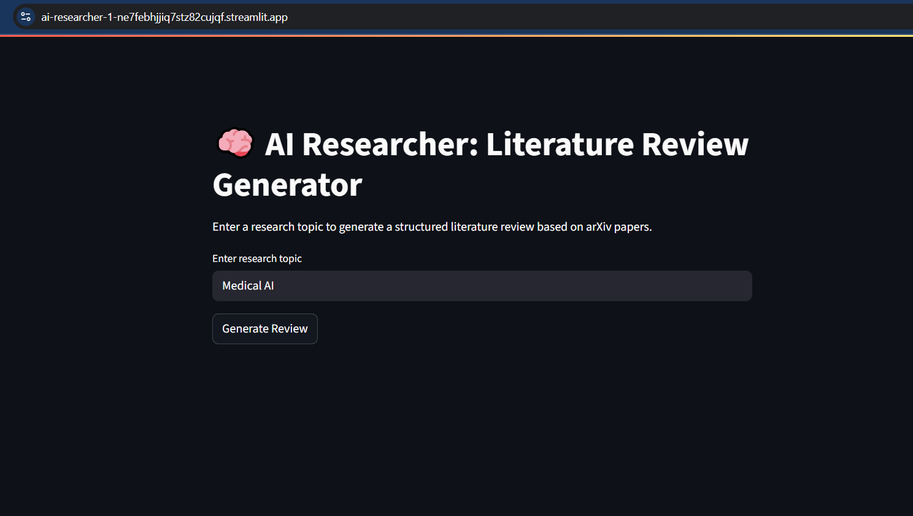

# 🎓 AI Researcher: Academic Literature Review Generator

**AI Researcher** is a lightweight academic tool that automates the generation of structured literature reviews from recent research papers on [arXiv.org](https://arxiv.org). It is designed to support **students**, **researchers**, and **educators** in quickly synthesizing scholarly content across scientific domains — with **open-access tools only** (no OpenAI or paid APIs).

---

## 🧠 What It Does

- 🔍 **Fetches** recent, relevant papers from arXiv based on your query
- 📄 **Summarizes** abstracts using `distilbart-cnn-12-6` (Transformer model)
- 🧾 **Generates structured reviews** (Introduction, Key Findings, Analysis, Gaps) with `LaMini-Flan-T5`
- 📚 **Creates an automatic bibliography** using arXiv metadata
- 🖥️ **Runs as a Streamlit web app** – simple and accessible

---

## 🧪 Example Output

### 📘 Topic: "AI in Medical Imaging"

- 📄 4–6 paragraph structured literature review (approx. 1000–1500 words)
- ✅ Automatically formatted bibliography
- 🎓 Suitable for academic writing and early-stage research

<details>
<summary>📷 Show Screenshot</summary>




</details>

---

## 🎯 Use Cases

- Undergraduate or graduate students writing **literature surveys**
- Researchers performing **rapid topic overviews**
- Educators preparing **academic summaries** or class material
- Thesis or dissertation writers gathering **related work**

---

## 📦 Installation

Clone the repository and install requirements:

```bash
git clone https://github.com/yourusername/ai-researcher.git
cd ai-researcher
pip install -r requirements.txt
